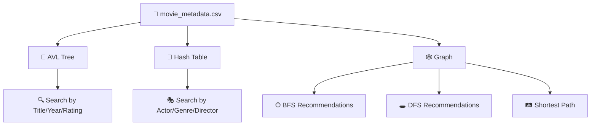

<div align="center">


[](https://isocpp.org/)
[]()
[]()
[](https://github.com/AbdulAzeemHashmi/Movie-Data-Manager/stargazers)
[](https://github.com/AbdulAzeemHashmi/Movie-Data-Manager/network)

📚 A comprehensive **Movie Management System** built for the Data Structures course (Fall 2025) at **FAST NUCES, Islamabad**. Every structure, from Linked Lists to Graphs, is handcrafted from scratch to search, index, and analyze the IMDb 5000 movie dataset.

</div>

<div align="center">

</div>

---

## ⚠️ Key Constraint

> 🚫 The C++ Standard Template Library (STL) is strictly prohibited. AVL Trees, Hash Tables, Graphs, Linked Lists, Stacks, and Queues are all implemented manually.

---

## 👥 Team Members

<div align="center">

| 🧑‍💻 Name | 🆔 Roll Number | 📧 Email |
|---|---|---|
| Abdul Ghafoor | 24I 0118 | i240118@nu.edu.pk |
| Abdul Azeem | 24I 2013 | i242013@nu.edu.pk |

</div>

---

## 🧠 Core Data Structures

<div align="center">

| 🏗️ Structure | 🎯 Purpose |
|---|---|
| 🌳 **AVL Tree** | Stores all movie records, guarantees O(log n) search, insertion, and deletion by self balancing on title key |
| 🔑 **Hash Table** | Indexes movies by actor, genre, and director for near O(1) lookup, uses chaining for collision resolution |
| 🕸️ **Graph (Adjacency List)** | Models relationships between movies via shared actors and genres, powers the recommendation engine |
| 🔗 **Linked List** | Backbone collection used across every structure, also drives the custom Stack and Queue |
| 📥 **Stack** | Used by DFS traversal for recommendation |
| 📤 **Queue** | Used by BFS traversal for recommendation and shortest path |

</div>

<div align="center">



</div>

---

## ✨ Features

- 📄 **CSV Parser**, a custom built parser handles quoted fields, escaped characters, and malformed rows while loading 5000 plus records from `movie_metadata.csv`
- 🔍 **Search by Title**, O(log n) AVL tree lookup with case insensitive, whitespace trimmed matching
- 🎭 **Search by Actor, Genre, or Director**, hash table lookup returns all matching movies instantly
- 📅 **Search by Year**, full in order traversal filtered by release year
- ⭐ **Search by Rating**, range based traversal (for example 7.0 to 9.0)
- 🌐 **BFS Recommendations**, suggests movies by exploring the closest graph neighbors first (breadth first)
- 🕳️ **DFS Recommendations**, follows deep chains of related movies (depth first) for niche suggestions
- 🛤️ **Shortest Path (Movies)**, finds the minimum connection between two movies using BFS and parent pointer backtracking
- 🤝 **Shortest Path (Actors/Directors)**, finds how two people are connected through movies they share
- 🎬 **Co Actor Finder**, lists all actors who have appeared in movies alongside a given actor
- ✏️ **Update Rating**, modify the rating of any existing movie in place
- 🗑️ **Delete Movie**, removes a movie from the AVL tree, hash table indexes, and all graph adjacency lists cleanly

---

## 🚀 Installation and Usage

### ✅ Prerequisites

- A C++ compiler supporting C++11 or later (for example `g++`)
- `movie_metadata.csv` placed in the same directory as the executable

<details open>
<summary><b>1️⃣ 📥 Clone the repository</b></summary>
<br/>

```bash
git clone https://github.com/AbdulAzeemHashmi/Movie-Data-Manager.git
cd Movie-Data-Manager
```

</details>

<details open>
<summary><b>2️⃣ 🔨 Compile</b></summary>
<br/>

```bash
g++ "24I-0118_24I-2013_DS Project.cpp" -o MovieManager
```

</details>

<details open>
<summary><b>3️⃣ ▶️ Run</b></summary>
<br/>

```bash
./MovieManager
```

</details>

---

## 📋 Menu Options

```
🎬 === MOVIES MANAGER === 🎬
 1.  📃 Display All
 2.  🔍 Search Title
 3.  🎭 Search Actor / Genre / Director
 4.  📅 Search Year
 5.  ⭐ Search Rating
 6.  🌐 Recommendations (BFS)
 7.  🕳️ Recommendations (DFS)
 8.  🛤️ Shortest Path (Movies)
 9.  🤝 Shortest Path (Actors / Directors)
10.  ✏️ Update Rating
11.  🗑️ Delete Movie
12.  🎬 Find Co Actors
13.  🚪 Exit
```

<div align="center">


</div>

---

## 🗂️ Project Structure

```
MOVIE-DATA-MANAGER/
├── 📄 24I-0118_24I-2013_DS Project.cpp   # Main source file (all structures and logic)
├── 📕 24I-0118_24I-2013_DS Report.pdf    # Full project report
├── 📊 movie_metadata.csv                  # IMDb 5000 dataset (required at runtime)
└── 📘 README.md
```

---

## 🛠️ Implementation Notes

- 🔢 `max_links = 25` caps the number of graph edges created per actor/genre bucket to prevent density explosion on very common names.
- 🔡 `format_key()` normalizes all search keys to lowercase printable ASCII so searches are case insensitive.
- 🔄 AVL deletion uses an in order successor swap strategy and re indexes hash table references after the swap.
- 🔗 Graph edges are bidirectional and created automatically at insert time inside `HashTable::insert_item()`.

---

## 🎓 Course Info

<div align="center">

| Field | Detail |
|---|---|
| 📘 **Course** | Data Structures (Fall 2025) |
| 🏛️ **University** | FAST NUCES, Islamabad |

</div>

---

<div align="center">

### 🌟 If you found this project useful, consider giving it a star

[](https://github.com/AbdulAzeemHashmi)
[](https://github.com/AbdulAzeemHashmi/Movie-Data-Manager)

Made with 💙 and a lot of pointer chasing by Abdul Azeem and Abdul Ghafoor


</div>
